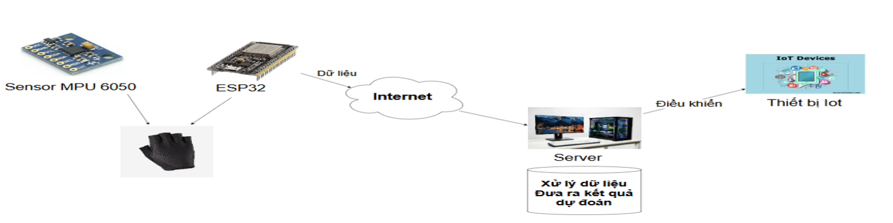

<h1 align="center">👋 XÂY DỰNG HỆ THỐNG NHẬN DIỆN CỬ CHỈ TAY SỬ DỤNG CẢM BIẾN GIA TỐC ĐỂ ĐIỀU KHIỂN THIẾT BỊ THÔNG MINH 🧠</h1>

<div align="center">
  
  <p align="center">
    
    
  </p>

  [](https://www.facebook.com/DNUAIoTLab)
  [](https://fitdnu.net/)
  [](https://dainam.edu.vn)

</div>

<h2 align="center">💡 Giải pháp điều khiển thiết bị IoT bằng cử chỉ tay trực quan, chi phí thấp</h2>

<p align="left">
  Dự án này trình bày một Hệ thống nhận diện cử chỉ tay (Hand Gesture Recognition - HGR) sử dụng Cảm biến đo lường quán tính (IMU) hay còn gọi là cảm biến gia tốc MPU6050 kết hợp với vi điều khiển ESP32 và mô hình Học Sâu Long Short-Term Memory (LSTM). Hệ thống hoạt động theo kiến trúc Client-Server (TCP/IP), cho phép người dùng thực hiện các cử chỉ động (ví dụ: 'xoay trái', 'đấm thẳng') để điều khiển các thiết bị ngoại vi trong nhà thông minh (LED, Còi, LCD, Quạt). Giải pháp này cân bằng giữa chi phí thấp, tính riêng tư (không dùng camera) và hiệu suất nhận diện cao. 🚀
</p>

---

## 🌟 GIỚI THIỆU HỆ THỐNG 🤖

- **Cảm biến IMU:** Sử dụng MPU6050 để thu thập dữ liệu 6 trục (Gia tốc: $a_x, a_y, a_z$ và Con quay: $g_x, g_y, g_z$) của chuyển động tay.
- **Mô hình AI:** Xây dựng, huấn luyện và triển khai mô hình **LSTM** để phân loại chính xác các chuỗi thời gian (time-series) cử chỉ.
- **Kiến trúc TCP/IP:** Giao tiếp Client-Server qua Wi-Fi nội bộ bằng Socket TCP, đảm bảo tốc độ và độ tin cậy của việc truyền dữ liệu cảm biến và lệnh điều khiển.
- **Điều khiển thời gian thực (Gần):** Sau khi dự đoán cử chỉ, Server Python gửi lệnh đến một ESP32 thứ hai để điều khiển các thiết bị IoT (LED, Còi, LCD, Quạt).

---

## 🏗️ KIẾN TRÚC HỆ THỐNG 🔧

Hệ thống hoạt động qua 3 khối chức năng chính:

<p align="center">
  
</p>

1. **Khối Cảm biến (Client):** ESP32 + MPU6050. Thu thập 50 mẫu dữ liệu 6 trục khi được kích hoạt và gửi đến Server qua **Port 5000**.
2. **Khối Server Xử lý (Python):** PC/Laptop chạy `server_predict.py`. Nhận dữ liệu thô, tiền xử lý (chuẩn hóa), dự đoán bằng mô hình LSTM, và gửi lệnh điều khiển.
3. **Khối Điều khiển (Control):** ESP32 riêng biệt. Lắng nghe lệnh điều khiển từ Server qua **Port 6000** và kích hoạt thiết bị ngoại vi.

---

## 📂 CẤU TRÚC DỰ ÁN 🗂️

```
Project
├── Arduino_Uno/
│   ├── esp32 with mpu6050.ino     # 💻 Mã nguồn Client (Thu thập & Gửi dữ liệu IMU)
│   └── esp32_control_device.ino   # 💻 Mã nguồn Control (Nhận lệnh & Điều khiển thiết bị)
├── gesture_data/                  # 📊 Chứa dữ liệu IMU
├── images/                        # 🖼️ Chứa hình ảnh (logo, sơ đồ kiến trúc)
├── collect_data.py                # Luồng Offline: Script Server TCP thu thập dữ liệu thô
├── clean_data_trim_window.py      # Luồng Offline: Script Tiền xử lý (cắt tĩnh, cửa sổ trượt)
├── train_lstm.py                  # Luồng Offline: Script Huấn luyện mô hình LSTM
├── server_predict.py              # Luồng Online: Script Server TCP dự đoán thời gian thực
├── gesture_model_lstm.h5          # Tệp mô hình LSTM đã huấn luyện
├── scaler.joblib                  # Tệp bộ chuẩn hóa (StandardScaler) dùng cho dự đoán
├── model_config.json              # Tệp cấu hình mô hình (max_len, n_features)
└── README.md                      # Tệp hướng dẫn dự án (Bạn đang xem)
```

---

## 🛠️ CÔNG NGHỆ SỬ DỤNG 💻

<div align="center">

### 📡 Phần cứng
[](https://www.espressif.com/)
[-green?style=for-the-badge&logo=bosch)](https://www.invensense.tdk.com/products/motion-tracking/6-axis/mpu-6050/)
[](https://www.arduino.cc/)
[](https://en.wikipedia.org/wiki/Transmission_Control_Protocol)

### 🖥️ Phần mềm
[]()
[]()
[]()
[]()
</div>

---

## 🛠️ YÊU CẦU HỆ THỐNG 🔌

### 🔌 Phần cứng
- **2 x ESP32 Dev Kit:** Một cho cảm biến (Client) và một cho điều khiển (Control).
- **1 x Cảm biến MPU6050 (hoặc IMU 6/9 trục khác):** Gắn vào ESP32 Client.
- **Thiết bị ngoại vi:** LED, Còi Buzzer, Màn hình LCD, Quạt.
- **Máy chủ:** PC/Laptop chạy Python, kết nối cùng mạng Wi-Fi với các ESP32.

### 💻 Phần mềm
- **Arduino IDE:** Với các thư viện `Adafruit_MPU6050`, `WiFiClient`.
- **Python 3:**
  - **Thư viện Python:** `tensorflow`, `numpy`, `pandas`, `sklearn`, `joblib`, `socket`, `keyboard`.

### 🚨 Lưu ý cấu hình
- **Địa chỉ IP:** Đảm bảo `serverIP` (trong code Arduino) và `HOST` (trong code Python) trỏ đúng đến IP của máy tính chạy Server Python.
- **Port:** Port 5000 (Data) và Port 6000 (Control) phải được mở và không bị Firewall chặn.

---

## 🚀 HƯỚNG DẪN TRIỂN KHAI ⚙️

### 1. Chuẩn bị Mô hình AI (Luồng Offline)

#### A. Thu thập Dữ liệu
1. **Kết nối:** Nạp `esp32 with mpu6050.ino` lên ESP32 Cảm biến và đảm bảo nó kết nối được với Server Python.
2. **Chạy thu thập:** Trên PC, chạy script:
   ```bash
   python scripts/collect_data.py
   ```
3. **Thực hiện cử chỉ:** Khi Server yêu cầu (ví dụ: `[GESTURE] === Thu cử chỉ 5 ===`), người dùng thực hiện cử chỉ. Dữ liệu sẽ được lưu vào `data/gesture_data/`.

#### B. Tiền xử lý & Huấn luyện
1. **Tiền xử lý:** Làm sạch, cắt bỏ phần tĩnh và tạo cửa sổ trượt:
   ```bash
   python scripts/clean_data_trim_window.py
   ```
2. **Huấn luyện:** Xây dựng, huấn luyện mô hình LSTM và lưu các tệp cần thiết vào thư mục `models/`:
   ```bash
   python scripts/train_lstm.py
   ```

### 2. Chạy Hệ thống Điều khiển (Luồng Online - Thời gian thực)

1. **Nạp code Điều khiển:** Nạp `esp32_control_device.ino` lên ESP32 Điều khiển. Thiết bị này sẽ kết nối với Server Python qua Port 6000.
2. **Khởi động Server:** Chạy Server dự đoán chính. Server sẽ tải mô hình, mở Port 5000 và 6000:
   ```bash
   python scripts/server_predict.py
   ```
3. **Kích hoạt:** Khi Server đã sẵn sàng, nhấn phím **'s'** trên Server để gửi lệnh **"start 0"** đến Khối Cảm biến.
4. **Thực hiện:** Người dùng thực hiện cử chỉ. Sau khi 50 mẫu được gửi về, Server sẽ dự đoán và gửi lệnh điều khiển tương ứng đến Khối Điều khiển.

---

## 📖 ÁNH XẠ CỬ CHỈ & LỆNH ĐIỀU KHIỂN 👨‍💻


| Label Cử chỉ | Tên Cử chỉ (Ví dụ) | Lệnh gửi đến Khối Điều khiển (Port 6000) | Hành động tương ứng |
|--------------|--------------------|------------------------------------------|----------------------|
| **0** | Tay Đứng Im       | `BUZZER_OFF`                                 | Tắt Còi báo              |
| **1** | Vẫy Trái          | `LED_ON`                                     | Bật LED                  |
| **2** | Vẫy Phải          | `LED_OFF`                                    | Tắt LED                  |
| **3** | Chặt Xuống        | `BUZZER_ON`                                  | Bật Còi báo              |
| **4** | Hất Lên           | `LCD_COUNTDOWN`                              | Màn Hình LCD Đếm Ngược   |
| **5** | Xoay Trái         | `FAN_ON`                                     | Bật Quạt                 |
| **6** | Đấm Thẳng         | `FAN_OFF`                                    | Tắt Quạt                 |

---

## 🤝 TÁC GIẢ 👥

Dự án được phát triển bởi:

- **Nguyễn Ánh Cương**
- **Vũ Văn Hiệp**

© 2025 NHÓM 3, KHOA CÔNG NGHỆ THÔNG TIN, TRƯỜNG ĐẠI HỌC ĐẠI NAM.
